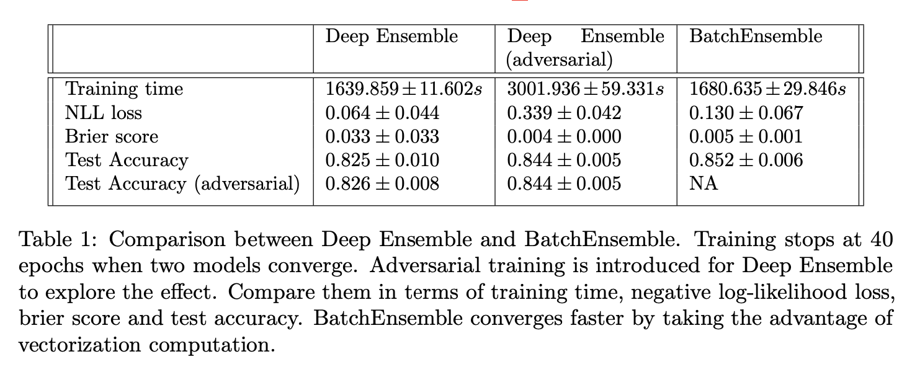

# CS4875 research project
Quantifying Uncertainty in Deep Learning

## Literature Survey

* [Simple and Scalable Predictive Uncertainty Estimation using Deep Ensembles](https://arxiv.org/pdf/1612.01474v2)
* [Deep Ensembles: A Loss Landscape Perspective](https://arxiv.org/abs/1912.02757)
* [Loss Surfaces, Mode Connectivity, and Fast Ensembling of DNNs](https://arxiv.org/pdf/1802.10026.pdf)
* [Large Scale Structure of Neural Network Loss Landscapes](https://arxiv.org/abs/1906.04724v1)
* [Can You Trust Your Model's Uncertainty? Evaluating Predictive Uncertainty Under Dataset Shift](https://arxiv.org/abs/1906.02530)
* [Pitfalls of In-Domain Uncertainty Estimation and Ensembling in Deep Learning](https://arxiv.org/abs/2002.06470)
* [BatchEnsemble: An Alternative Approach to Efficient Ensemble and Lifelong Learning](https://arxiv.org/abs/2002.06715)
* [A Review of Uncertainty Quantification in Deep Learning: Techniques, Applications and Challenges](https://arxiv.org/abs/2011.06225)
* [Snapshot Ensembles: Train 1, get M for free](https://arxiv.org/abs/1704.00109)
* [Hyperparameter Ensembles for Robustness and Uncertainty Quantification](https://arxiv.org/abs/2006.13570v1)
* [Estimating the mean and variance of the target probability distribution](https://ieeexplore.ieee.org/document/374138)
* [Probabilistic Backpropagation for Scalable Learning of Bayesian Neural Networks](https://arxiv.org/abs/1502.05336)
* [Dropout as a Bayesian Approximation: Representing Model Uncertainty in Deep Learning](https://deepai.org/publication/dropout-as-a-bayesian-approximation-representing-model-uncertainty-in-deep-learning)

## Experiment Results

### Deep Ensemble & BatchEnsemble

### FGEnsemble

